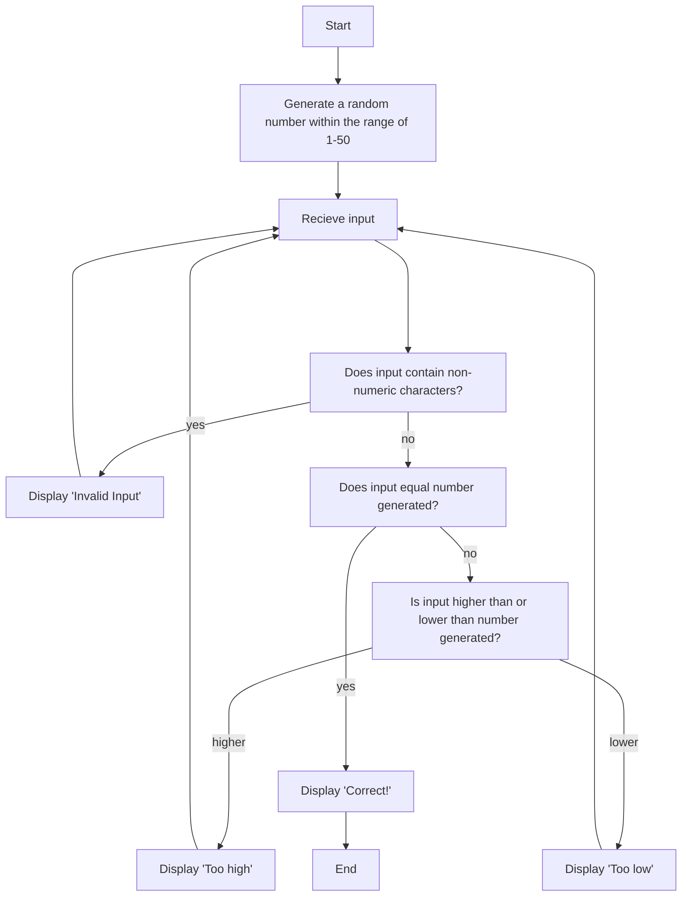

The program will first generate a random number between 1 and 50, then it will accept an input from the user.
It will then check for any non-numerical characters in the input: If yes, then the program will state that the input was invalid and accept another input, if not, then it will
proceed to the next step.
Next, the program will check if the input equals the number it randomly generated: If it is, then it will state that the answer is corrrect and will then end the game. If it
isn't, then the program will check and state if the input is higher or lower than the generated number and accept another input.
